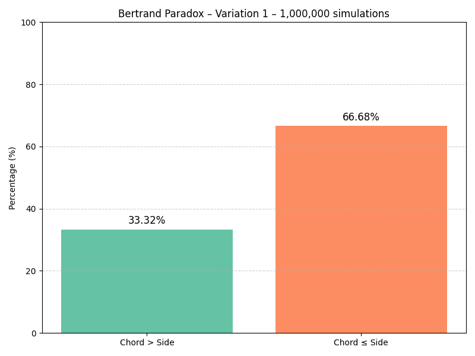
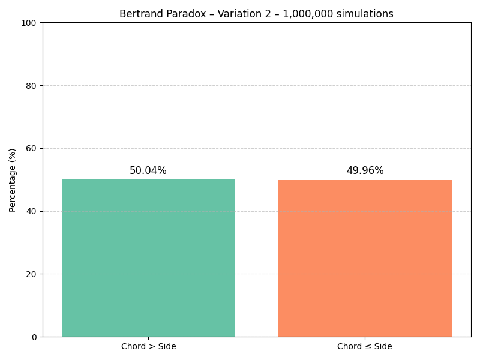
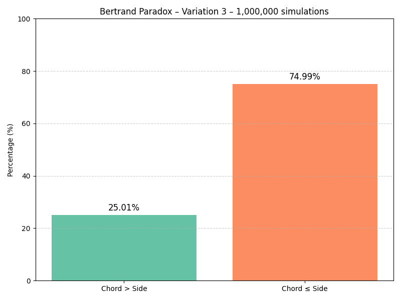

# Bertrand Paradox – Simulation in Python and Java

This project contains a full simulation of the **Bertrand Paradox**, a classic problem in probability theory, implemented in **Python** and **Java**. It analyzes how the definition of a "random chord" in a circle can lead to **different probabilities** for the same question.

## 🧠 What is Bertrand's Paradox?

The paradox, introduced by Joseph Bertrand in 1889, asks:

> "If a chord is drawn at random in a circle, what is the probability that it is longer than the side of the equilateral triangle inscribed in the circle?"

### 🔍 The Catch

The answer **depends on how the chord is generated**, leading to **different probabilities**:
1. **By choosing two random points on the circumference**.
2. **By choosing a random radius and a random midpoint along it**.
3. **By choosing a random point inside the circle as the chord's midpoint**.

## 📊 Expected Results

| Variation | Method                                 | Expected Probability |
|----------:|----------------------------------------|----------------------:|
| 1         | Random endpoints on the circumference  | ≈ 1/3 (~33.3%)        |
| 2         | Random radius + midpoint along it      | ≈ 1/2 (50%)           |
| 3         | Random midpoint anywhere in circle     | ≈ 1/4 (~25%)          |

## 📌 Project Structure

### 🐍 Python Scripts
All Python scripts are located in the `Python/` directory.

- `FirstVariation.py`: Implements the first variation using random endpoints.
- `SecondVariation.py`: Implements the second variation using midpoint on radius.
- `ThirdVariation.py`: Implements the third variation using a random point inside the circle.

### ☕ Java Implementations
Java implementations are located in the `Java/` directory.

- `Main.java`: First variation.
- `App.java`: Second variation.
- `Main_App.java`: Third variation.
- `entities/Triangle.java` and `entities/Sources.java`: Utility classes for geometric calculations.

## 📷 Sample Graphs

### Variation 1 – Random Endpoints


### Variation 2 – Midpoint on Radius


### Variation 3 – Random Midpoint Inside Circle


> You can generate these plots automatically by running the Python scripts.

## 🚀 How to Run

### Python (requires `matplotlib`)
```bash
cd Python
pip install matplotlib
python FirstVariation.py
python SecondVariation.py
python ThirdVariation.py
```

### Java (requires JDK 11+)
Compile and run each variation:

```bash
cd Java
javac application/Main.java
java application.Main

javac application/App.java
java application.App

javac application/Main_App.java
java application.Main_App
```

## 🗃️ How to Contribute

Feel free to:
- Improve visualizations
- Refactor code for performance
- Add GUI or web interface for educational use
- Translate for more languages

## 📚 References

- Bertrand, J. *Calcul des Probabilités*, 1889.
- [Wikipedia - Bertrand's Paradox](https://en.wikipedia.org/wiki/Bertrand_paradox_(probability))

---

## 🧑‍💻 Author

Developed by [João Victor Ferreira]  
Projeto educacional de simulação computacional para entendimento do Paradoxo de Bertrand.

---

## 📃 License

This project is licensed under the MIT License.
